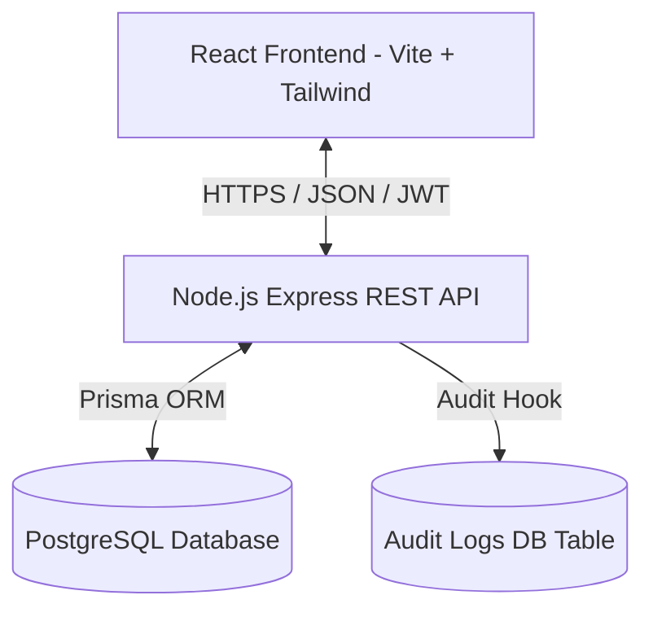

# Meal Coupon Management System (MCMS)

An enterprise-grade, scalable, role-based, bilingual, and audit-ready **Meal Coupon Management System**.

## 🚀 Architecture Overview

MCMS is designed with modern enterprise software architectural principles, emphasizing modular separation of concerns, defensive security measures, robust session control, and high scalability.



### Key Technical Pillars

1. **Scalable & Modular Layout:** Features are grouped into cohesive modules (routers, services, controllers) on the backend and structured sub-folders on the frontend, avoiding tight coupling and enabling painless scaling.
2. **Role-Based Access Control (RBAC):** Restrict system capability by user roles:
   * **`ADMIN`:** Complete system management, database initialization, global analytics, and user provisioning.
   * **`MANAGER`:** Meal planning, voucher/coupon creation, beneficiary groups management, and report generation.
   * **`VENDOR`:** Meal redemption operations, scanning terminal interface, and coupon redemption history verification.
   * **`BENEFICIARY`:** Portal access to check assigned coupons, digital QR display, and personal redemption logs.
3. **Bilingual Readiness (i18n):**
   * **Client:** Full translation using `react-i18next` namespaces and local caching.
   * **Server:** Localization-friendly routing structure with active middleware inspecting headers (`Accept-Language`) to adjust localized responses.
4. **Audit Trail Logging:** All core data mutation operations automatically fire an `AuditService` action capturing the executing `actorId`, operational event key, target entity type/ID, snapshots of pre/post states (for effortless rollbacks/debugging), source IP address, and user-agent details.
5. **Docker Containerized Deployment:** Production and development container builds with isolated environments and automatic PostgreSQL health checks.

---

## 📁 System Folder Structure

```text
/
├── docker-compose.yml       # Orchestrates PostgreSQL, API, and Frontend container engines
├── README.md                 # System Developer Manual
├── package.json              # Monorepo orchestration scripts
│
├── backend/                  # RESTful API Engine
│   ├── prisma/               # Prisma Database Schemas, Migrations & Seeds
│   └── src/                  # Express REST Application
│       ├── config/           # Database configurations and environment schemas
│       ├── middlewares/      # Security, Authentication, RBAC, and Logger middlewares
│       ├── modules/          # Cohesive business modules (auth, coupons, meals, users, audit)
│       └── utils/            # Winston loggers, standard JSON response structures, JWT handlers
│
└── frontend/                 # Client Single Page App
    └── src/
        ├── components/       # Custom enterprise-styled UI controls and layout contexts
        ├── context/          # Context states (e.g. AuthContext)
        ├── i18n/             # Multi-language translation packs and hooks
        ├── pages/            # View containers (Login, Dashboard, Coupons, Users, Meals, etc.)
        ├── services/         # Axios api request wrappers
        └── utils/            # Styling class merges and Date formatter helpers
```

---

## 🛠️ Getting Started

### Prerequisites
- [Node.js](https://nodejs.org/en/) (v18.x or above)
- [Docker](https://www.docker.com/) & Docker Compose

### Fast local bootstrap (Docker-based)
1. Clone the repository and copy the environment blueprints:
   ```bash
   cp .env.example .env
   cp backend/.env.example backend/.env
   cp frontend/.env.example frontend/.env
   ```
2. Launch the docker services:
   ```bash
   npm run docker:up
   ```
   This command starts the database, runs schema migrations/seeders, boots up the REST backend, and serves the React bundle.

### Manual Local Execution
1. Install dependencies across the workspaces:
   ```bash
   npm run install:all
   ```
2. Navigate to `backend/` to configure Prisma:
   ```bash
   npm run prisma:migrate
   npm run prisma:seed
   ```
3. Start the dev servers simultaneously:
   ```bash
   npm run dev
   ```
   * **Frontend server:** `http://localhost:5173`
   * **Backend API server:** `http://localhost:5000`

---

## 🔒 Security & JWT Policies

- **Access Tokens:** Signed with HS256 JWT, short-lived configurations (configurable up to 24h). Passed via standard `Authorization: Bearer <token>` headers.
- **Defensive Headers:** Configured using `helmet` to block clickjacking, XSS injections, and frame-sniffing.
- **Request Throttling:** Backed by `express-rate-limit` on login interfaces to block brute-force attempts.
